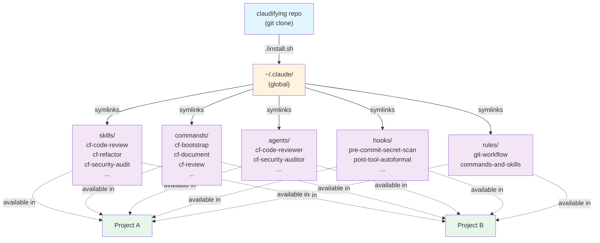
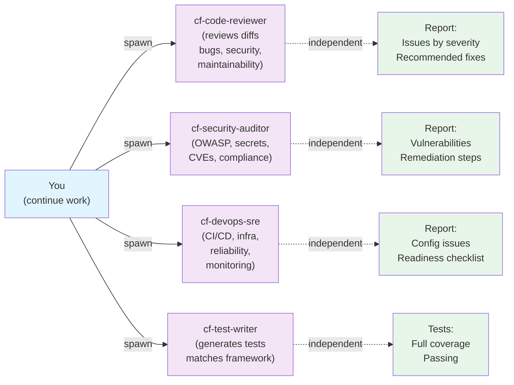
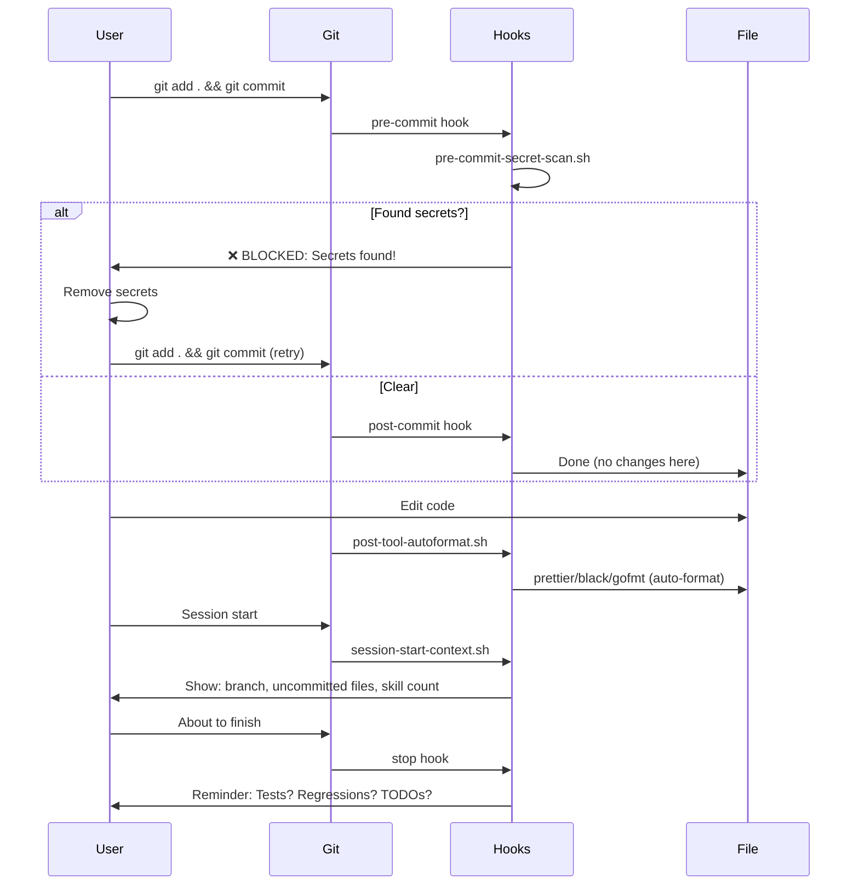

```text
   ___ _                _ _  __       _
  / __\ | __ _ _   _  __| (_)/ _|_   _(_)_ __   __ _
 / /  | |/ _` | | | |/ _` | | |_| | | | | '_ \ / _` |
/ /___| | (_| | |_| | (_| | |  _| |_| | | | | | (_| |
\____/|_|\__,_|\__,_|\__,_|_|_|  \__, |_|_| |_|\__, |
                                 |___/         |___/
        one install · every project · 2,478 tools
```

## Overview

> **2,478 Extensions Fully Organized** — Claudifying is a unified extension library for Claude Code. Build once. Reuse everywhere. Contribute back.

Complete inventory: **1,544 skills** | **585 plugins** | **335 commands** | **5 agents** | **7 hooks** | **2 rules** — all organized, categorized, and instantly available globally.

Stop rebuilding the same tools in every project. Grab them here via slash commands. Stop burning tokens on tool recreation. Start shipping faster.

## Why It Exists — [See in example across below](#see-it-in-action)

Every developer using Claude Code rebuilds the same tools repeatedly:
- Code review process? Built from scratch.
- Security audit checklist? Reinvented.
- Test generation patterns? Duplicated.
- Git workflow rules? Copied by hand.

**This wastes tokens. Wastes time. Wastes context.**

Claudifying centralizes these tools as reusable, shareable, instantly-available extensions. Build once. Use everywhere. Contribute back. Done.

## What You Get

Clone this repo, run the installer, and get **2,478 extensions** available in **every project** — instantly via slash commands. No setup per-project. No token waste on tool recreation.

| Category | Count | Examples |
|----------|-------|----------|
| **Skills** | 1,544 | 213 native (code-review, refactor, security-audit, test-writer, tools-video-*, tools-git-worktree-*, +others) + 1,331 marketplace (devops, AI/ML, security, testing, +18 categories) |
| **Plugins** | 585 | AI/ML (37), database (29), devops (44), security (31), testing (30), performance (25), +13 more categories |
| **Commands** | 335 | 5 native user-invocable (bootstrap, document, review, test-all, triage-pr) + 329 marketplace slash commands (cf-prefixed) + 1 pr-workflows |
| **Agents** | 5 | `cf-code-reviewer`, `cf-security-auditor`, `cf-devops-sre`, `cf-test-writer`, `cf-skill-auditor` |
| **Hooks** | 7 | `pre-commit-secret-scan`, `post-tool-autoformat`, `session-start-context`, `stop-verify`, `post-merge-update-{skills,plugins,agents}` |
| **Rules** | 2 | `git-workflow.md`, `commands-and-skills.md` |

## The Token Math

**Without Claudifying:** Every project, every task...
```
You: "Review my code"
Claude: *rebuilds code review checklist from scratch* (1000+ tokens)
You: "Refactor this"
Claude: *rebuilds refactoring patterns from scratch* (800+ tokens)
You: "Generate tests"
Claude: *rebuilds test framework detection from scratch* (600+ tokens)
```
**Result:** ~2400+ tokens wasted on tool recreation per project.

**With Claudifying:**
```
You: /cf-code-review
Claude: *uses pre-built skill* (0 tokens on rebuilding)
You: /cf-refactor
Claude: *uses pre-built skill* (0 tokens on rebuilding)
You: /cf-test-writer
Claude: *uses pre-built skill* (0 tokens on rebuilding)
```
**Result:** Tools ready instantly. Focus on the actual work.

---

## Prerequisites

- [Claude Code](https://docs.anthropic.com/en/docs/claude-code) installed (`claude` CLI on `PATH`).
- macOS or Linux. Bash 4+ / zsh. `git`, `curl`.

## Quick Start

### Recommended — one-line npx install

```bash
npx github:pauldx/claudifying
```

That's it. The installer clones the repo to `~/.claudifying`, then symlinks every skill/plugin/command into `~/.claude/`. Works in **every project** instantly.

```bash
# Update later
npx github:pauldx/claudifying update

# Preview without changes
npx github:pauldx/claudifying --dry-run

# See what's installed
npx github:pauldx/claudifying status

# Remove all symlinks
npx github:pauldx/claudifying uninstall
```

### Manual clone (alternative)

```bash
# 1. Clone
git clone https://github.com/pauldx/claudifying.git ~/claudifying
cd ~/claudifying

# 2. Install (one-time)
./install.sh --force

# 3. Use in ANY project
cd ~/my-project
/cf-code-review          # Works everywhere now
/cf-refactor
/cf-security-audit
/cf-bootstrap
/cf-test-writer
```

All 2,478 extensions available globally via `~/.claude/` symlinks — zero setup overhead, zero token waste.

---

## See It In Action

Ten 15-second demos. Each shows one tool doing real work — bugs found, audits run, PDFs rendered, videos dubbed, statuslines updating, agents reporting back.

### Install — clone, install, use everywhere
> One install. 2,478 extensions live in every project on your machine.


### `/cf-code-review` — structured PR review (bugs, security, maintainability)
> Severity-tagged findings with file:line + fix. Drop in any project, run before push.


### `/cf-tools-video-dub` — re-voice or translate video with Whisper + Edge TTS
> 270+ neural voices, 40 languages. Transcribes, translates, dubs, muxes — one command.


### `/cf-tools-pdf-create` — polished PDF from markdown in one shot
> Theme + TOC + page numbers + branded footer. No LaTeX, no Pandoc dance.


### `/cf-security-audit` — OWASP Top 10 + secret + CVE scan
> Whole-tree sweep across OWASP categories, dependency CVEs, and committed-secret patterns.


### `/cf-tools-image-convert-svg-png` — pixel-perfect SVG → retina PNG via headless Chrome
> Browser-faithful render. Gradients, filters, drop-shadows all preserved. Where rsvg-convert fails.


### `/cf-test-writer` — generate framework-matching tests
> Detects vitest/jest/pytest/go-test, writes happy-path + edge + error cases, runs them.


### `/cf-tools-diagram-flowchart` — describe a process, get a Mermaid diagram
> Natural-language process → renderable Mermaid that GitHub displays inline.


### `/cf-tools-system-statusline` — live token / git / model bar for Claude Code
> Watch the bar update across a real session: branch flip, token climb, compaction badge, post-compact reset.


### `cf-code-reviewer` agent — parallel review while you keep coding
> Spawn an independent subagent on your branch. Keep working. Read its report when it pings back.


---

## How It Works



**Symlinks = Live Updates.** When you `git pull`, all symlinked extensions update instantly. No reinstall needed.

---

## What's Included (2,478 Extensions)

### Skills (1,544) — Invocable Tools via `/cf-...`

**Native Skills (213):**

**Core workflow (4):** `/cf-code-review`, `/cf-refactor`, `/cf-security-audit`, `/cf-test-writer`
**Code (2):** `/cf-code-optmz-caveman`, `/cf-code-optmz-graph`
**Gates / advisory (5):** `/cf-plan-gate`, `/cf-tdd-gate`, `/cf-devops`, `/cf-mcp-expert`, `/cf-ui-ux`
**Process (3):** `/cf-release-manager`, `/cf-optimize-performance`, `/cf-workflow-auto`
**Research (5):** `/cf-research-deep`, `/cf-competitive-intel`, `/cf-knowledge-structure`, `/cf-onchain`, `/cf-source-validation`
**Writing (5):** `/cf-copywriting`, `/cf-content-repurpose`, `/cf-scqa`, `/cf-summary-compressor`, `/cf-tone-enforcer`

**Tools — Media (8 video file-ops + 8 video creative + 12 audio + 17 image):**
- Video file-ops: `/cf-tools-video-{trim,thumbnail,rotate,speed,resize,mute,gif,watermark,loop,metadata,compress,join,extract}`
- Video creative: `/cf-tools-video-{captions,dub,editing-plan,hook-generator,script}`
- Audio: `/cf-tools-audio-{convert,trim,merge,normalize,extract-from-video,transcribe,tts,fade,speed,denoise,waveform,metadata}`
- Image: `/cf-tools-image-{resize,convert,compress,crop,rotate,strip-metadata,heic-to-jpg,favicon,thumbnail,watermark,palette,diff,fetch-logo,bg-remove,ocr,upscale,convert-svg-png}`

**Tools — Documents (7 PDF + 6 markdown):**
- PDF: `/cf-tools-pdf-{create,extract-text,merge,split,watermark,compress,to-images,info}`
- Markdown: `/cf-tools-md-{obsidian,toc,lint,to-html,to-docx,to-slides,render-preview,mermaid-render,syntax-highlight}`

**Tools — Diagram (4):** `/cf-tools-diagram-{excalidraw,flowchart,infographic,graphify}`

**Tools — Data + Text (10 data + 8 text):**
- Data: `/cf-tools-data-{csv-to-json,json-to-csv,csv-filter,csv-sort,json-flatten,json-merge,yaml-to-json,json-validate,json-query,csv-diff}`
- Text: `/cf-tools-text-{diff,dedupe,regex-replace,case-convert,slug-generate,base64,urlencode,sort-lines}`

**Tools — Net / Hash / Date (5 + 4 + 3):**
- Net: `/cf-tools-net-{http-request,dns-lookup,ssl-check,ip-info,whois-lookup}`
- Hash: `/cf-tools-hash-{sha256,hash-file,uuid,jwt-decode}`
- Date: `/cf-tools-date-{parse,convert-tz,cron-explain}`

**Tools — Web / System (6 + 6):**
- Web: `/cf-tools-web-{lighthouse-audit,html-format,css-minify,js-minify,sitemap-generate,og-image-render}`
- System: `/cf-tools-system-{cleanup-cache,statusline,disk-free,top-cpu,env-dump,brew-orphan}`

**Tools — Containers / Cloud (6 docker + 4 k8s + 4 aws + 4 gcp):**
- Docker: `/cf-tools-docker-{prune,stats,compose-validate,cleanup-images,run-pretty,logs-tail}`
- K8s: `/cf-tools-k8s-{pod-logs,pod-restart,get-events,kubectx-switch}`
- AWS: `/cf-tools-aws-{profile-switch,s3-ls,ec2-status,costs-summary}`
- GCP: `/cf-tools-gcp-{profile-switch,gcs-ls,run-list,costs-summary}`

**Tools — Git extras (14):** `/cf-tools-git-{create-repo,branch-cleanup,worktree-{init,check,cleanup,deliver},undo-last,rebase-undo,conflict-helper,blame-search,log-pretty,diff-stats,stash-helper,tag-version}`

**Tools — Productivity / Code / Archive (6 + 3 + 4):**
- Productivity: `/cf-tools-productivity-{qr-generate,qr-decode,clipboard-copy,color-picker,lorem-ipsum,password-gen}`
- Code: `/cf-tools-code-{count-loc,find-todo,find-fixme}`
- Archive: `/cf-tools-archive-{tar-create,tar-extract,zip-create,zip-extract}`

**Tools — Crypto / Shell (8 + 6):**
- Crypto: `/cf-tools-crypto-{ssh-keygen,gpg-encrypt,gpg-decrypt,gpg-sign,gpg-verify,openssl-keygen,password-hash-bcrypt,rsa-keygen}`
- Shell: `/cf-tools-shell-{which-bin,find-file,watch-dir,port-listening,kill-port,env-edit}`

**Tools — Notifications / AI / Browser (5 + 6 + 5):**
- Notify: `/cf-tools-notify-{slack-send,discord-send,macos-notify,email-send,telegram-send}`
- AI: `/cf-tools-ai-{anthropic-call,openai-call,ollama-call,prompt-test,embedding-generate,models-list}`
- Browser: `/cf-tools-browser-{screenshot-url,page-text,html-fetch,pdf-print-url,open-url}`

**Tools — Security scanners (5):** `/cf-tools-sast-{bandit-scan,eslint-security,semgrep-scan,gosec-scan,trivy-scan}`

**Tools — Extract / Misc (1):** `/cf-tools-extract-x` (X.com posts)

**Marketplace Skills (1,331, 20+ categories):**
- **01-20 numbered** (~497 skills) — DevOps, security, AI/ML, frontend, backend, testing, performance, data, AWS, GCP, API, technical docs, business automation, enterprise workflows
- **cf-* domain folders** (~834 skills) — analytics, ai-research, business-marketing, creative-design, database, design-to-code, development, document-processing, enterprise-communication, git, media, pocketbase, productivity, railway, scientific, +more

All skills symlinked to `~/.claude/skills/` and instantly available globally via `/cf-<skill-name>` slash commands.

---

### Commands (335) — Slash Command Tools

**Native Commands (5):**
- `/cf-bootstrap <type> <name>` — Scaffold command/skill/agent/hook from template
- `/cf-document [scope]` — Auto-generate or update docs (README, API, inline)
- `/cf-review [file|branch]` — Code review on current diff or staged changes
- `/cf-test-all [filter]` — Run full test suite (auto-detects framework)
- `/cf-triage-pr-review <owner>/<repo>#<pr>` — Process GitHub PR review comments

**Marketplace Commands (329):**
- All prefixed with `cf-` for namespace consistency, organized into 25+ categories. Highlights:
  - **Development (12):** `/cf-snippets`, `/cf-format`, `/cf-lint`, `/cf-test`, `/cf-debug`, `/cf-api-test`, `/cf-regex`, `/cf-database`, `/cf-git-assist`, `/cf-dependency`, `/cf-docker-cli`, `/cf-env-manager`
  - **Productivity (8):** `/cf-todo`, `/cf-timer`, `/cf-note`, `/cf-calendar`, `/cf-reminders`, `/cf-bookmark`, `/cf-dictionary`, `/cf-calculator`
  - **Writing & Content (10):** `/cf-grammar-check`, `/cf-markdown`, `/cf-word-count`, `/cf-paraphrase`, `/cf-summary`, `/cf-outline`, `/cf-tone-check`, `/cf-citation`, `/cf-template`, `/cf-glossary`
  - **Data & Analytics (10):** `/cf-csv-tools`, `/cf-json-tools`, `/cf-xml-tools`, `/cf-sql-query`, `/cf-chart`, `/cf-stats`, `/cf-conversion`, `/cf-comparison`, `/cf-aggregation`, `/cf-validation`
  - **Research & Learning (8):** `/cf-search`, `/cf-wikipedia`, `/cf-scholar`, `/cf-translation`, `/cf-explain`, `/cf-compare`, `/cf-timeline`, `/cf-mindmap`

See **[commands/CATALOG.md](./commands/CATALOG.md)** for complete reference.

---

### Plugins (585) — Domain-Specific Tool Collections

Organized into 18 categories with 15 native external plugins + 570 marketplace plugins:
- **AI/ML (37):** sentiment analysis, feature engineering, computer vision, NLP, deep learning
- **Database (29):** SQL optimization, query analysis, transaction monitoring, audit logging
- **DevOps (44):** CI/CD, infrastructure, deployment, container orchestration
- **Security (31):** vulnerability scanning, access control, RBAC, security auditing
- **Testing (30):** test coverage, mutation testing, regression tracking, visual testing
- **Performance (25):** profiling, memory leak detection, capacity planning, throughput analysis
- **Plus 12 more:** crypto, design, examples, business-tools, productivity, saas-packs, etc.
- **integration (5):** GitHub, Alpaca Trading, N8N, Memory, + 1 more
- **deepgraph (4):** React, TypeScript, Next.js, Vue
- **web-data (3):** Apify, BrightData, Browseract
- **productivity (3):** Google Workspace, Monday, Notion
- **marketing (2):** Facebook Ads, Google Ads
- **Plus:** research (1), filesystem (1), deepresearch (1), audio (1)

---

### Agents (5) — Specialized Subagents

**Native Agents (4):**
Spawn these as independent subagents for parallel, focused work.



| Agent | Role | When to Use |
|-------|------|------------|
| `cf-code-reviewer` | Senior code reviewer (bugs, security, maintainability) | Before PR, get independent second opinion |
| `cf-security-auditor` | Security specialist (OWASP, secrets, CVEs) | Before release, security compliance, audit |
| `cf-devops-sre` | DevOps/SRE engineer (CI/CD, infrastructure, reliability) | New service to prod, deployment review |
| `cf-test-writer` | Test engineer (generates comprehensive tests) | Add test coverage in parallel while you code |

**Marketplace Agents (1):**
| Agent | Role | When to Use |
|-------|------|------------|
| `cf-skill-auditor` | Skill validation and implementation auditor | Audit new skills/commands for quality and compliance |

---

### Hooks (4) — Automatic Triggers



| Hook | Trigger | Purpose |
|------|---------|---------|
| `pre-commit-secret-scan.sh` | Before commit | Block commits with exposed AWS keys, GitHub tokens, private keys, .env files |
| `post-tool-autoformat.sh` | After file edits | Auto-format code using project's formatter (Prettier, Black, gofmt, rustfmt) |
| `session-start-context.sh` | Session start | Print branch, uncommitted changes, available skills/commands |
| `stop-verify.sh` | Before stop | Remind to verify work: tests passed? regressions? TODOs left? |

**Safety:** All hooks read-only locally. Any future global-modifying hooks will backup + confirm before changes. See `.claude/hooks/README.md`.

---

### Rules (2) — Conditional Guidance

| Rule | When Loaded |
|------|------------|
| `git-workflow.md` | Working with git commits, branches, PRs, pushing code |
| `commands-and-skills.md` | Creating/editing commands or skills |

---

## Installation & Distribution

### For You (Individual Developer)

```bash
# Clone
git clone https://github.com/pauldx/claudifying.git ~/claudifying
cd ~/claudifying

# Install globally (symlinks to ~/.claude/)
./install.sh              # preview what would install
./install.sh --force      # go ahead, backup conflicts
./install.sh --uninstall  # remove all symlinks

# Use in any project
cd ~/my-project && /cf-code-review
```

### For Teams

#### Option 1: Team Fork (Recommended)
```bash
# Team maintainer creates fork
git clone https://github.com/pauldx/claudifying.git my-team-claudifying
cd my-team-claudifying
git remote rename origin upstream

# Add team skills (if any)
mkdir .claude/skills/cf-my-team-skill
# ... create skill ...

git add .
git commit -m "feat: add team skill"
git push origin main

# Share with team: https://github.com/my-team/my-team-claudifying
```

**Team members:**
```bash
git clone https://github.com/my-team/my-team-claudifying ~/claudifying
cd ~/claudifying
./install.sh

# Get upstream updates + team extensions
git pull origin main
```

#### Option 2: Central Installation
```bash
# Team lead (once)
git clone https://github.com/pauldx/claudifying.git /opt/claudifying
/opt/claudifying/install.sh --force

# All team members get extensions automatically
```

### Updates

```bash
# Individual
cd ~/claudifying && git pull
# Extensions update instantly — no reinstall needed

# Team (pull updates + stay in sync)
cd /opt/claudifying
git pull origin main           # Get claudifying updates
git pull upstream main         # If forked: get upstream updates
./install.sh --force           # Reinstall only if new extensions added
```

---

## Project Structure

```
claudifying/
│
├── skills/                          # 1,544 skills (213 native + 1,331 marketplace)
│   ├── 01-devops-basics/            # 25 marketplace skills
│   ├── 02-devops-advanced/          # 25 marketplace skills
│   ├── ... (03-20 marketplace categories)
│   ├── 20-enterprise-workflows/     # 25 marketplace skills
│   └── native/                      # 213 native skills
│       ├── cf-code-review/
│       ├── cf-refactor/
│       ├── cf-security-audit/
│       ├── cf-test-writer/
│       ├── cf-code-optmz-caveman/
│       ├── ... (39 more native skills)
│
├── plugins/                         # 585 plugins (15 native + 570 marketplace)
│   ├── ai-agency/                   # ~8 plugins
│   ├── ai-ml/                       # ~37 plugins
│   ├── api-development/             # ~27 plugins
│   ├── ... (18 marketplace categories)
│   └── testing/                     # ~30 plugins
│
├── commands/                        # 335 commands (5 native + 329 marketplace + 1 pr-workflows)
│   ├── CATALOG.md                   # Command reference
│   ├── catalog.json                 # Command metadata
│   └── README.md
│
├── .claude/                         # Claude Code local config
│   ├── commands/                    # 5 native structured workflows
│   │   ├── general/
│   │   │   ├── cf-bootstrap.md
│   │   │   ├── cf-document.md
│   │   │   ├── cf-review.md
│   │   │   ├── cf-test-all.md
│   │   │   └── cf-triage-pr-review.md
│   │   └── marketplace/             # 329 marketplace commands (25+ categories)
│   │       ├── productivity/        # 8 commands
│   │       ├── development/         # 12 commands
│   │       ├── writing/             # 10 commands
│   │       ├── data/                # 10 commands
│   │       └── research/            # 8 commands
│   │
│   ├── agents/                      # 5 agents (4 native + 1 marketplace)
│   │   ├── cf-code-reviewer.yml
│   │   ├── cf-security-auditor.yml
│   │   ├── cf-devops-sre.yml
│   │   ├── cf-test-writer.yml
│   │   └── cf-skill-auditor.yml     # Marketplace agent
│   │
│   ├── hooks/                       # 4 automation hooks
│   │   ├── pre-commit-secret-scan.sh
│   │   ├── post-tool-autoformat.sh
│   │   ├── session-start-context.sh
│   │   └── stop-verify.sh
│   │
│   └── rules/                       # 2 conditional guidance
│       ├── git-workflow.md
│       └── commands-and-skills.md
│
├── install.sh                       # Global installer
├── uninstall.sh                     # Uninstaller
├── update-marketplace-skills.sh     # Auto-sync skills on git pull
├── update-marketplace-plugins.sh    # Auto-sync plugins on git pull
├── update-marketplace-agents.sh     # Auto-sync agents on git pull
├── CLAUDE.md                        # Full project documentation
├── INDEX.md                         # Complete extension index
├── README.md                        # This file
├── LICENSE                          # MIT
└── docs/
    └── (future docs)
```

---

## Contributing a New Skill or Command

### Before You Start

1. **Check if it exists** — Search [GitHub Issues](https://github.com/pauldx/claudifying/issues)
2. **Choose type** — Skill, command, agent, hook, or rule?
3. **Pick namespace** — `/cf-code-*`, `/cf-tools-*`, `/cf-tools-[category]-*`

### Step-by-Step

```bash
# 1. Create feature branch
git checkout -b feature/my-skill

# 2. Create skill directory
mkdir .claude/skills/cf-my-skill
# OR for tools
mkdir skills/cf-my-tool

# 3. Add required files
# - SKILL.md (metadata: name, description)
# - Implementation (script, code, etc.)
# - README.md (usage guide with examples)

# 4. Test locally
./install.sh --force
# Test in another project: /cf-my-skill

# 5. Commit
git add .
git commit -m "feat: add cf-my-skill - brief description"

# 6. Push & create PR
git push origin feature/my-skill
```

See [CLAUDE.md](./CLAUDE.md) for full contributing guidelines.

---

## Why Contribute

Every extension you add becomes instantly available to thousands of developers across hundreds of projects — **forever**. Your tool saves tokens, saves time, and compounds over time.

**Your contribution:**
- One security audit skill → Used by 1000s of devs → Millions of tokens saved globally
- One refactoring pattern → Reused in every project → Never rebuilt again
- One deployment workflow → Standardized across teams → Zero context waste

You're not writing throwaway code. You're building infrastructure that outlives projects.

---

## For Teams

Share Claudifying with your team. Everyone gets:
- Same tools. Same patterns. Same quality standards.
- Zero per-project setup. Instant consistency.
- Token savings scale with team size (5 devs = 5× the savings).

Fork it. Add team-specific skills. Share the repo URL. Done.

---

## Example Workflows

### Workflow 1: Code Review Before Push

```bash
# You've made changes, ready to push
cd ~/my-project

# Option A: Review current diff
/cf-review

# Option B: Spawn independent reviewer while you continue
# (Use /cf-bootstrap or trigger cf-code-reviewer agent)
```

### Workflow 2: Full Security Audit Before Release

```bash
# Spawn security auditor as subagent
# (Use cf-security-auditor agent)
# It scans in parallel while you continue

# Wait for report: vulnerabilities, hardcoded secrets, CVE dependencies
```

### Workflow 3: Generate Test Coverage

```bash
# Add new feature
vim src/feature.js

# Spawn test writer as subagent
# (Use cf-test-writer agent)
# It writes tests while you work

# Tests appear, run, and pass
```

---

## Namespace Organization

All extensions use **`cf-`** prefix for easy discovery:

| Prefix | Purpose | Examples |
|--------|---------|----------|
| `/cf-code-*` | Code tools & GitHub | `/cf-code-review`, `/cf-code-optmz-*`, `/cf-tools-git-create-repo` |
| `/cf-tools-*` | Media & utilities | `/cf-tools-extract-x`, `/cf-tools-image-*`, `/cf-tools-audio-*` |
| No prefix | Hooks, rules | `pre-commit-secret-scan.sh`, `git-workflow.md` |

---

## Documentation

Deep dives into specific topics:

- **[DEVELOPER-JOURNEY.md](./docs/DEVELOPER-JOURNEY.md)** — Visual guides for onboarding, daily workflows, agent teams, contribution cycles (Mermaid diagrams)
- **[DAILY-PRACTICES.md](./docs/DAILY-PRACTICES.md)** — Best practices: session habits, context management, team collaboration, using toolkit effectively
- **[AGENT-TEAMS.md](./docs/AGENT-TEAMS.md)** — Run multiple agents in parallel using worktrees + tmux (code-reviewer, security-auditor, test-writer on different branches simultaneously)
- **[CLAUDE.md](./CLAUDE.md)** — Full inventory of all 28+ extensions, skill capabilities, command details

---

## Get Involved

**Use it:**
```bash
git clone https://github.com/pauldx/claudifying.git && cd claudifying && ./install.sh
```

**Contribute a tool:**
```bash
git checkout -b feature/my-amazing-tool
mkdir .claude/skills/cf-my-tool
# Build something awesome
git push && create PR
```

**Report issues or request features:**
- [GitHub Issues](https://github.com/pauldx/claudifying/issues)
- [GitHub Discussions](https://github.com/pauldx/claudifying/discussions)

**Spread the word:**
Star this repo. Share it with your team. Help devs everywhere stop wasting tokens on tool recreation.

---

## License & Credits

MIT License — all native content. Bundled marketplace skills, plugins, and
commands retain their upstream licenses (predominantly MIT) per the
`LICENSE` files shipped inside each package.

Upstream sources, marketplace authors, and re-attribution instructions live
in **[CREDITS.md](./CREDITS.md)**. If you authored a bundled skill or
plugin and want your attribution surfaced differently, open an issue.

---

## Resources

- [Claude Code Documentation](https://code.claude.com)
- [Anthropic API Docs](https://anthropic.com/api)
- [Claude Code GitHub](https://github.com/anthropics/claude-code)

---

---

## Final Inventory

| Extension Type | Count | Location |
|---|---|---|
| **Skills** | 1,544 | `skills/` + `.claude/skills/` |
| **Plugins** | 585 | `plugins/` |
| **Commands** | 335 | `.claude/commands/` |
| **Agents** | 5 | `.claude/agents/` |
| **Hooks** | 7 | `.claude/hooks/` |
| **Rules** | 2 | `.claude/rules/` |
| **Total** | **2,478** | Fully organized & documented |

**Built by the community, for the community.**

Repo: https://github.com/pauldx/claudifying  
Owner: Debashis Paul (@pauldx)  
Updated: 2026-05-11
Maintained by: pauldx
