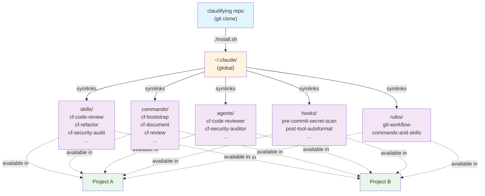
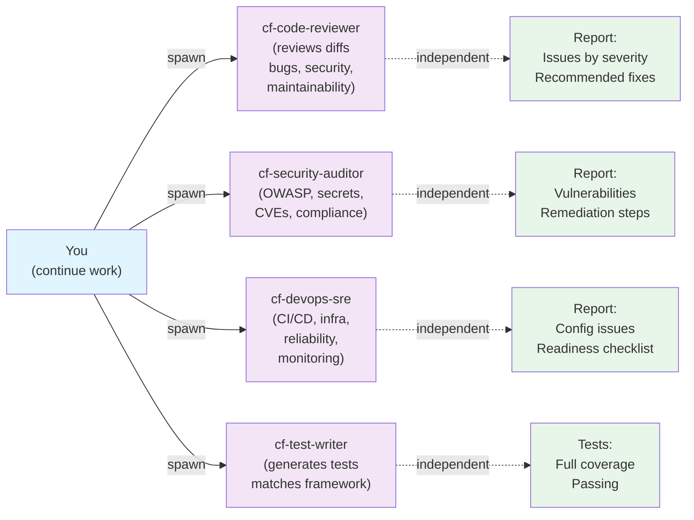
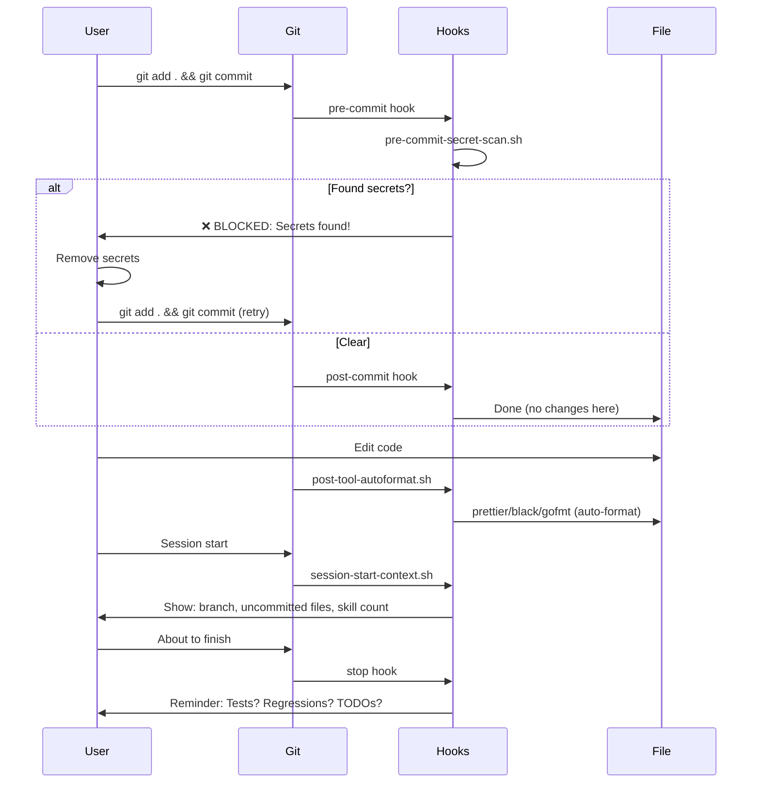

# Claudifying

> **1,500+ Marketplace Extensions + 1,700+ Custom Skills** — Claudifying is a unified extension library for Claude Code. Build once. Reuse everywhere. Contribute back.

All organized, categorized, and instantly available: **6,021 marketplace skills** (82 categories) | **329 marketplace commands** (24 categories) | **85 MCP servers** (13 categories) | **5 agents** | **4 hooks** | **2 rules**.

Stop rebuilding the same tools in every project. Grab them here via slash commands. Stop burning tokens on tool recreation. Start shipping faster.

## Why It Exists

Every developer using Claude Code rebuilds the same tools repeatedly:
- Code review process? Built from scratch.
- Security audit checklist? Reinvented.
- Test generation patterns? Duplicated.
- Git workflow rules? Copied by hand.

**This wastes tokens. Wastes time. Wastes context.**

Claudifying centralizes these tools as reusable, shareable, instantly-available extensions. Build once. Use everywhere. Contribute back. Done.

## What You Get

Clone this repo, run the installer, and get **7,500+ extensions** available in **every project** — instantly via slash commands. No setup per-project. No token waste on tool recreation.

| Category | Count | Examples |
|----------|-------|----------|
| **Skills** | 6,021 files (82 categories) | Marketplace: development, ai-research, scientific, creative-design, document-processing + 42 more. Native: code-review, refactor, security-audit, test-writer, +30 more |
| **Commands** | 329 (24 categories) | `/cf-create-architecture-documentation`, `/cf-supabase-backup-manager`, `/cf-write-tests`, `/cf-create-pr`, + 325 more |
| **MCP Servers** | 85 (13 categories) | devtools (44), database (8), web (6), browser-automation (6), integration (5), + 8 more |
| **Agents** | 5 | `cf-code-reviewer`, `cf-security-auditor`, `cf-devops-sre`, `cf-test-writer`, `cf-skill-auditor` |
| **Hooks** | 4 | `pre-commit-secret-scan`, `post-tool-autoformat`, `session-start-context`, `stop-verify` |
| **Rules** | 2 | `git-workflow.md`, `commands-and-skills.md` |

## The Token Math

**Without Claudifying:** Every project, every task...
```
You: "Review my code"
Claude: *rebuilds code review checklist from scratch* (1000+ tokens)
You: "Refactor this"
Claude: *rebuilds refactoring patterns from scratch* (800+ tokens)
You: "Generate tests"
Claude: *rebuilds test framework detection from scratch* (600+ tokens)
```
**Result:** ~2400+ tokens wasted on tool recreation per project.

**With Claudifying:**
```
You: /cf-code-review
Claude: *uses pre-built skill* (0 tokens on rebuilding)
You: /cf-refactor
Claude: *uses pre-built skill* (0 tokens on rebuilding)
You: /cf-test-writer
Claude: *uses pre-built skill* (0 tokens on rebuilding)
```
**Result:** Tools ready instantly. Focus on the actual work.

---

## Quick Start

```bash
# 1. Clone
git clone https://github.com/pauldx/claudifying.git ~/claudifying
cd ~/claudifying

# 2. Install (one-time)
./install.sh --force

# 3. Use in ANY project
cd ~/my-project
/cf-code-review          # Works everywhere now
/cf-refactor
/cf-security-audit
/cf-bootstrap
/cf-test-writer
```

That's it. All 75+ extensions available globally via `~/.claude/` symlinks — zero setup overhead, zero token waste.

---

## How It Works



**Symlinks = Live Updates.** When you `git pull`, all symlinked extensions update instantly. No reinstall needed.

---

## What's Included (7,500+ Extensions)

### Skills (6,021 files across 82 categories) — Invocable Tools via `/cf-...`

**Marketplace Skills (5,466 files, 47 categories):**
- **development** (1,192 files) — coding, frameworks, tools
- **ai-research** (1,530 files) — AI/ML research, models
- **scientific** (1,032 files) — scientific computing, data science
- **creative-design** (307 files) — design, creative tools
- **document-processing** (528 files) — document handling, parsing
- **business-marketing** (102 files), **enterprise-communication** (124 files), **productivity** (141 files), **web-development** (105 files)
- Plus 39 additional categories (database, security, deployment, testing, etc.)

**Native Skills (44):**

**Workflow Skills (4):**
- `/cf-code-review` — Structured review: bugs, security, maintainability, performance
- `/cf-refactor` — Targeted refactoring with test verification between each change
- `/cf-security-audit` — OWASP Top 10 + secret detection + dependency CVEs
- `/cf-test-writer` — Generate tests matching project's framework & conventions

**Tool Skills (9):**
- `/cf-code-optmz-caveman` — Optimize code: perf, readability, efficiency (terse feedback)
- `/cf-code-optmz-graph` — Build knowledge graph from any code folder
- `/cf-code-git-create-repo` — Create + initialize git repos with templates
- `/cf-tools-extract-x <url>` — Extract X.com post content (text, author, date, media)
- `/cf-tools-image-convert-svg-png` — Convert SVG to retina PNG via Chrome headless
- `/cf-tools-audio` — Audio processing tools
- `/cf-tools-video` — Video processing tools
- `/cf-tools-image` — Image processing tools
- `/cf-tools-statusline` — Terminal statusline configuration

**Extended Skills (31):**
- **Coding (9):** `/cf-branch-cleanup`, `/cf-cleanup-cache`, `/cf-devops`, `/cf-mcp-expert`, `/cf-optimize-performance`, `/cf-plan-gate`, `/cf-release-manager`, `/cf-tdd-gate`, `/cf-workflow-auto`
- **Research (5):** `/cf-competitive-intel`, `/cf-research-deep`, `/cf-knowledge-structure`, `/cf-onchain`, `/cf-source-validation`
- **Tools (4):** `/cf-create-pdf`, `/cf-extract-video`, `/cf-graphify`, `/cf-obsidian-update`
- **Visual Design (4):** `/cf-excalidraw`, `/cf-flowchart`, `/cf-infographic`, `/cf-ui-ux`
- **Video (4):** `/cf-video-captions`, `/cf-video-editing-plan`, `/cf-video-hook-generator`, `/cf-video-script`
- **Writing (5):** `/cf-content-repurpose`, `/cf-copywriting`, `/cf-scqa`, `/cf-summary-compressor`, `/cf-tone-enforcer`

**Marketplace Skills (500):**
- Organized into **21 categories** (01-devops-basics through 20-enterprise-workflows)
- 25 skills per category covering DevOps, security, enterprise workflows, and more
- All available as `/cf-<skill-name>` via `/` command search

---

### Commands (329) — Slash Command Tools

**Native Commands (5):**
- `/cf-bootstrap <type> <name>` — Scaffold command/skill/agent/hook from template
- `/cf-document [scope]` — Auto-generate or update docs (README, API, inline)
- `/cf-review [file|branch]` — Code review on current diff or staged changes
- `/cf-test-all [filter]` — Run full test suite (auto-detects framework)
- `/cf-triage-pr-review <owner>/<repo>#<pr>` — Process GitHub PR review comments

**Marketplace Commands (324):**
- Organized into **24 categories**:
  - **database (9):** `/cf-supabase-backup-manager`, `/cf-supabase-migration-assistant`, + 7 more
  - **deployment (11):** `/cf-blue-green-deployment`, `/cf-setup-kubernetes-deployment`, + 9 more
  - **documentation (10):** `/cf-create-architecture-documentation`, `/cf-create-onboarding-guide`, + 8 more
  - **git-workflow (14):** `/cf-create-pr`, `/cf-branch-cleanup`, `/cf-worktree-init`, + 11 more
  - **google-workspace (49):** `/cf-gws-gmail`, `/cf-gws-drive`, `/cf-gws-sheets`, + 46 more
  - **project-management (20):** `/cf-create-feature`, `/cf-create-prd`, `/cf-release`, + 17 more
  - **testing (15):** `/cf-write-tests`, `/cf-generate-tests`, `/cf-test-coverage`, + 12 more
  - **utilities (21):** `/cf-code-review`, `/cf-refactor-code`, `/cf-explain-code`, + 18 more
  - Plus 16 additional categories (development, setup, performance, security, etc.)

See **[commands/CATALOG.md](./commands/CATALOG.md)** for complete command reference.

---

### MCP Servers (85) — Model Context Protocol Integrations

**Organized into 13 categories:**
- **devtools (44):** GitHub, GitLab, Terraform, Postman, Stripe, Pulumi, Railway, Jupyter, CircleCI, Sentry, Grafana, + 34 more
- **database (8):** PostgreSQL, MongoDB, MySQL, Redis, Neon, Supabase, DBHub, + 1 more
- **browser_automation (6):** Playwright, Browserbase, BrowserUse, + 3 more
- **web (6):** SearxNG, TinyFish, Web Fetch, Web Reader, + 2 more
- **integration (5):** GitHub, Alpaca Trading, N8N, Memory, + 1 more
- **deepgraph (4):** React, TypeScript, Next.js, Vue
- **web-data (3):** Apify, BrightData, Browseract
- **productivity (3):** Google Workspace, Monday, Notion
- **marketing (2):** Facebook Ads, Google Ads
- **Plus:** research (1), filesystem (1), deepresearch (1), audio (1)

---

### Agents (5) — Specialized Subagents

**Native Agents (4):**
Spawn these as independent subagents for parallel, focused work.



| Agent | Role | When to Use |
|-------|------|------------|
| `cf-code-reviewer` | Senior code reviewer (bugs, security, maintainability) | Before PR, get independent second opinion |
| `cf-security-auditor` | Security specialist (OWASP, secrets, CVEs) | Before release, security compliance, audit |
| `cf-devops-sre` | DevOps/SRE engineer (CI/CD, infrastructure, reliability) | New service to prod, deployment review |
| `cf-test-writer` | Test engineer (generates comprehensive tests) | Add test coverage in parallel while you code |

**Marketplace Agents (1):**
| Agent | Role | When to Use |
|-------|------|------------|
| `cf-skill-auditor` | Skill validation and implementation auditor | Audit new skills/commands for quality and compliance |

---

### Hooks (4) — Automatic Triggers



| Hook | Trigger | Purpose |
|------|---------|---------|
| `pre-commit-secret-scan.sh` | Before commit | Block commits with exposed AWS keys, GitHub tokens, private keys, .env files |
| `post-tool-autoformat.sh` | After file edits | Auto-format code using project's formatter (Prettier, Black, gofmt, rustfmt) |
| `session-start-context.sh` | Session start | Print branch, uncommitted changes, available skills/commands |
| `stop-verify.sh` | Before stop | Remind to verify work: tests passed? regressions? TODOs left? |

**Safety:** All hooks read-only locally. Any future global-modifying hooks will backup + confirm before changes. See `.claude/hooks/README.md`.

---

### Rules (2) — Conditional Guidance

| Rule | When Loaded |
|------|------------|
| `git-workflow.md` | Working with git commits, branches, PRs, pushing code |
| `commands-and-skills.md` | Creating/editing commands or skills |

---

## Installation & Distribution

### For You (Individual Developer)

```bash
# Clone
git clone https://github.com/pauldx/claudifying.git ~/claudifying
cd ~/claudifying

# Install globally (symlinks to ~/.claude/)
./install.sh              # preview what would install
./install.sh --force      # go ahead, backup conflicts
./install.sh --uninstall  # remove all symlinks

# Use in any project
cd ~/my-project && /cf-code-review
```

### For Teams

#### Option 1: Team Fork (Recommended)
```bash
# Team maintainer creates fork
git clone https://github.com/pauldx/claudifying.git my-team-claudifying
cd my-team-claudifying
git remote rename origin upstream

# Add team skills (if any)
mkdir .claude/skills/cf-my-team-skill
# ... create skill ...

git add .
git commit -m "feat: add team skill"
git push origin main

# Share with team: https://github.com/my-team/my-team-claudifying
```

**Team members:**
```bash
git clone https://github.com/my-team/my-team-claudifying ~/claudifying
cd ~/claudifying
./install.sh

# Get upstream updates + team extensions
git pull origin main
```

#### Option 2: Central Installation
```bash
# Team lead (once)
git clone https://github.com/pauldx/claudifying.git /opt/claudifying
/opt/claudifying/install.sh --force

# All team members get extensions automatically
```

### Updates

```bash
# Individual
cd ~/claudifying && git pull
# Extensions update instantly — no reinstall needed

# Team (pull updates + stay in sync)
cd /opt/claudifying
git pull origin main           # Get claudifying updates
git pull upstream main         # If forked: get upstream updates
./install.sh --force           # Reinstall only if new extensions added
```

---

## Project Structure

```
claudifying/
│
├── skills/                          # 1,044 skills (44 native + 500 marketplace + native extended)
│   ├── 01-devops-basics/            # 25 marketplace skills
│   ├── 02-devops-advanced/          # 25 marketplace skills
│   ├── ... (03-20 marketplace categories)
│   ├── 20-enterprise-workflows/     # 25 marketplace skills
│   └── native/                      # 44 native skills
│       ├── cf-code-review/
│       ├── cf-refactor/
│       ├── cf-security-audit/
│       ├── cf-test-writer/
│       ├── cf-code-optmz-caveman/
│       ├── ... (39 more native skills)
│
├── plugins/                         # 624 plugins (15 native + 609 marketplace)
│   ├── ai-agency/                   # ~8 plugins
│   ├── ai-ml/                       # ~37 plugins
│   ├── api-development/             # ~27 plugins
│   ├── ... (18 marketplace categories)
│   └── testing/                     # ~30 plugins
│
├── commands/                        # 53 commands (5 native + 48 marketplace)
│   ├── CATALOG.md                   # Command reference
│   ├── catalog.json                 # Command metadata
│   └── README.md
│
├── .claude/                         # Claude Code local config
│   ├── commands/                    # 5 native structured workflows
│   │   ├── general/
│   │   │   ├── cf-bootstrap.md
│   │   │   ├── cf-document.md
│   │   │   ├── cf-review.md
│   │   │   ├── cf-test-all.md
│   │   │   └── cf-triage-pr-review.md
│   │   └── marketplace/             # 48 marketplace commands (5 categories)
│   │       ├── productivity/        # 8 commands
│   │       ├── development/         # 12 commands
│   │       ├── writing/             # 10 commands
│   │       ├── data/                # 10 commands
│   │       └── research/            # 8 commands
│   │
│   ├── agents/                      # 5 agents (4 native + 1 marketplace)
│   │   ├── cf-code-reviewer.yml
│   │   ├── cf-security-auditor.yml
│   │   ├── cf-devops-sre.yml
│   │   ├── cf-test-writer.yml
│   │   └── cf-skill-auditor.yml     # Marketplace agent
│   │
│   ├── hooks/                       # 4 automation hooks
│   │   ├── pre-commit-secret-scan.sh
│   │   ├── post-tool-autoformat.sh
│   │   ├── session-start-context.sh
│   │   └── stop-verify.sh
│   │
│   └── rules/                       # 2 conditional guidance
│       ├── git-workflow.md
│       └── commands-and-skills.md
│
├── install.sh                       # Global installer
├── uninstall.sh                     # Uninstaller
├── update-marketplace-skills.sh     # Auto-sync skills on git pull
├── update-marketplace-plugins.sh    # Auto-sync plugins on git pull
├── update-marketplace-agents.sh     # Auto-sync agents on git pull
├── CLAUDE.md                        # Full project documentation
├── INDEX.md                         # Complete extension index
├── README.md                        # This file
├── LICENSE                          # MIT
└── docs/
    └── (future docs)
```

---

## Contributing a New Skill or Command

### Before You Start

1. **Check if it exists** — Search [GitHub Issues](https://github.com/pauldx/claudifying/issues)
2. **Choose type** — Skill, command, agent, hook, or rule?
3. **Pick namespace** — `/cf-code-*`, `/cf-tools-*`, `/cf-tools-[category]-*`

### Step-by-Step

```bash
# 1. Create feature branch
git checkout -b feature/my-skill

# 2. Create skill directory
mkdir .claude/skills/cf-my-skill
# OR for tools
mkdir skills/cf-my-tool

# 3. Add required files
# - SKILL.md (metadata: name, description)
# - Implementation (script, code, etc.)
# - README.md (usage guide with examples)

# 4. Test locally
./install.sh --force
# Test in another project: /cf-my-skill

# 5. Commit
git add .
git commit -m "feat: add cf-my-skill - brief description"

# 6. Push & create PR
git push origin feature/my-skill
```

See [CLAUDE.md](./CLAUDE.md) for full contributing guidelines.

---

## Why Contribute

Every extension you add becomes instantly available to thousands of developers across hundreds of projects — **forever**. Your tool saves tokens, saves time, and compounds over time.

**Your contribution:**
- One security audit skill → Used by 1000s of devs → Millions of tokens saved globally
- One refactoring pattern → Reused in every project → Never rebuilt again
- One deployment workflow → Standardized across teams → Zero context waste

You're not writing throwaway code. You're building infrastructure that outlives projects.

---

## For Teams

Share Claudifying with your team. Everyone gets:
- Same tools. Same patterns. Same quality standards.
- Zero per-project setup. Instant consistency.
- Token savings scale with team size (5 devs = 5× the savings).

Fork it. Add team-specific skills. Share the repo URL. Done.

---

## Example Workflows

### Workflow 1: Code Review Before Push

```bash
# You've made changes, ready to push
cd ~/my-project

# Option A: Review current diff
/cf-review

# Option B: Spawn independent reviewer while you continue
# (Use /cf-bootstrap or trigger cf-code-reviewer agent)
```

### Workflow 2: Full Security Audit Before Release

```bash
# Spawn security auditor as subagent
# (Use cf-security-auditor agent)
# It scans in parallel while you continue

# Wait for report: vulnerabilities, hardcoded secrets, CVE dependencies
```

### Workflow 3: Generate Test Coverage

```bash
# Add new feature
vim src/feature.js

# Spawn test writer as subagent
# (Use cf-test-writer agent)
# It writes tests while you work

# Tests appear, run, and pass
```

---

## Namespace Organization

All extensions use **`cf-`** prefix for easy discovery:

| Prefix | Purpose | Examples |
|--------|---------|----------|
| `/cf-code-*` | Code tools & GitHub | `/cf-code-review`, `/cf-code-optmz-*`, `/cf-code-git-create-repo` |
| `/cf-tools-*` | Media & utilities | `/cf-tools-extract-x`, `/cf-tools-image-*`, `/cf-tools-audio-*` |
| No prefix | Hooks, rules | `pre-commit-secret-scan.sh`, `git-workflow.md` |

---

## Documentation

Deep dives into specific topics:

- **[DEVELOPER-JOURNEY.md](./docs/DEVELOPER-JOURNEY.md)** — Visual guides for onboarding, daily workflows, agent teams, contribution cycles (Mermaid diagrams)
- **[DAILY-PRACTICES.md](./docs/DAILY-PRACTICES.md)** — Best practices: session habits, context management, team collaboration, using toolkit effectively
- **[AGENT-TEAMS.md](./docs/AGENT-TEAMS.md)** — Run multiple agents in parallel using worktrees + tmux (code-reviewer, security-auditor, test-writer on different branches simultaneously)
- **[CLAUDE.md](./CLAUDE.md)** — Full inventory of all 28+ extensions, skill capabilities, command details

---

## Get Involved

**Use it:**
```bash
git clone https://github.com/pauldx/claudifying.git && cd claudifying && ./install.sh
```

**Contribute a tool:**
```bash
git checkout -b feature/my-amazing-tool
mkdir .claude/skills/cf-my-tool
# Build something awesome
git push && create PR
```

**Report issues or request features:**
- [GitHub Issues](https://github.com/pauldx/claudifying/issues)
- [GitHub Discussions](https://github.com/pauldx/claudifying/discussions)

**Spread the word:**
Star this repo. Share it with your team. Help devs everywhere stop wasting tokens on tool recreation.

---

## License

MIT License — All extensions inherit MIT unless specified otherwise.

---

## Resources

- [Claude Code Documentation](https://code.claude.com)
- [Anthropic API Docs](https://anthropic.com/api)
- [Claude Code GitHub](https://github.com/anthropics/claude-code)

---

---

## Final Inventory

| Extension Type | Count | Location |
|---|---|---|
| **Skills** | 1,044 | `skills/` + `.claude/skills/` |
| **Plugins** | 624 | `plugins/` |
| **Commands** | 53 | `.claude/commands/` |
| **Agents** | 5 | `.claude/agents/` |
| **Hooks** | 4 | `.claude/hooks/` |
| **Rules** | 2 | `.claude/rules/` |
| **Total** | **1,732** | Fully organized & documented |

**Built by the community, for the community.**

Repo: https://github.com/pauldx/claudifying  
Owner: Debashis Paul (@pauldx)  
Updated: 2026-05-11
Maintained by: pauldx
