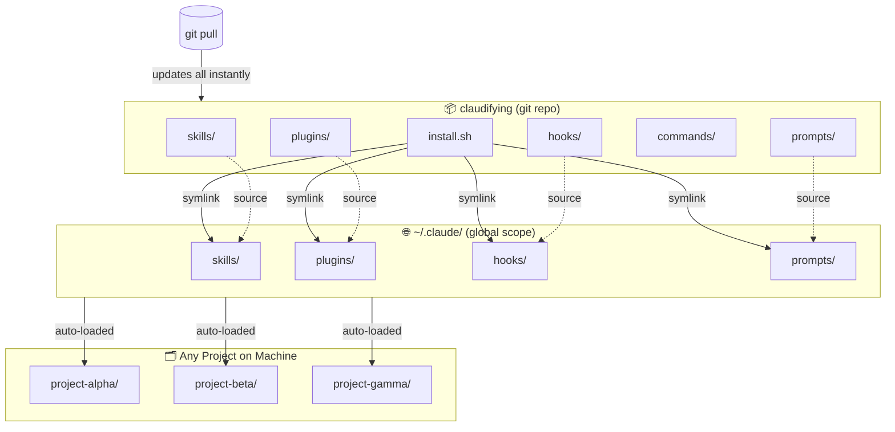
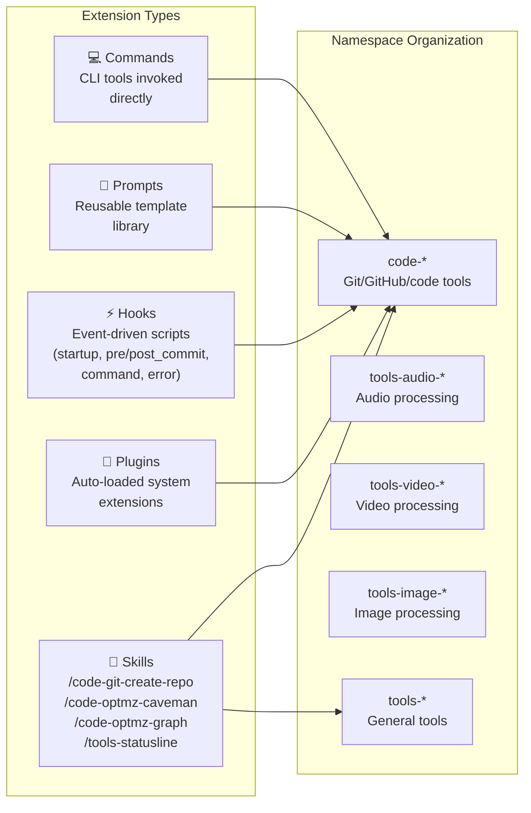
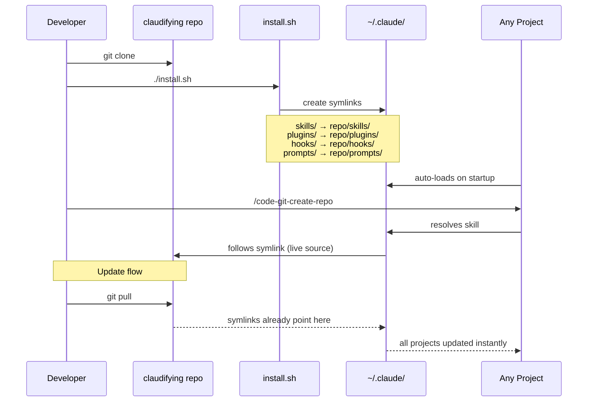
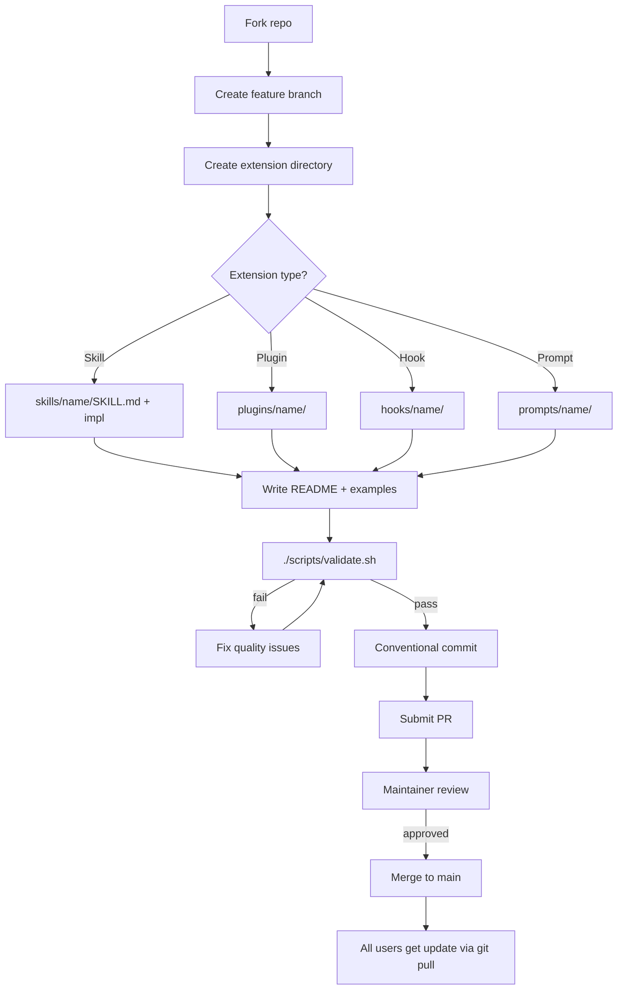

# Claudifying — Architecture Diagram & Benefits

---

## System Overview



---

## Component Architecture



---

## Distribution Model



---

## Contribution Lifecycle



---

## Current Extension Inventory

| Extension | Type | Namespace | Status |
|-----------|------|-----------|--------|
| `code-git-create-repo` | Skill | `code-*` | Active |
| `code-optmz-caveman` | Skill | `code-*` | Active |
| `code-optmz-graph` | Skill | `code-*` | Active |
| `tools-statusline` | Skill | `tools-*` | Active |
| `tools-audio` | Skill | `tools-audio-*` | Placeholder |
| `tools-image` | Skill | `tools-image-*` | Placeholder |
| `tools-video` | Skill | `tools-video-*` | Placeholder |

---

## Benefits

### Zero-Config Global Access
Once installed, every extension is available in **every project on the machine** — no per-project setup, no copying files, no re-configuration. Claude Code picks up `~/.claude/` automatically.

### Single Source of Truth
Symlinks point back to the git repo. One `git pull` updates all extensions everywhere simultaneously. No stale copies, no version drift across projects.

### Instant Updates, Zero Friction
```
git pull   # → every extension on machine updated
```
No re-running install. No file copying. Extensions update live because symlinks resolve at access time.

### Community-Driven Extensibility
Structured contribution workflow (fork → template → validate → PR) with:
- `CONTRIBUTING.md` — contribution guide for new contributors
- `scripts/validate.sh` — automated quality gate before review
- Conventional commits — clear, parseable history

### Namespace Isolation
Prefix-based naming (`code-*`, `tools-audio-*`, `tools-video-*`) prevents collisions and makes discovery intuitive. Categories scale without restructuring.

### Safe Installs
`install.sh` backs up existing files with timestamps before overwriting. `--dry-run` flag previews changes. `--force` opt-in for overrides. Existing symlinks handled intelligently.

### Minimal Disk Footprint
Symlinks not copies. One repo, unlimited projects. No duplication.

### Separation of Concerns
Five distinct extension types with clear contracts:
- **Skills** — user-invoked tools (`/skill-name`)
- **Plugins** — system-level auto-loaded extensions
- **Hooks** — event-driven automation (startup, commits, errors)
- **Prompts** — reusable template library
- **Commands** — direct CLI execution

Each type lives in its own directory, independently manageable.

### Reproducible Dev Environments
Clone + `./install.sh` = identical Claude Code setup on any machine. Teams share the same extension set, reducing "works on my machine" drift.
