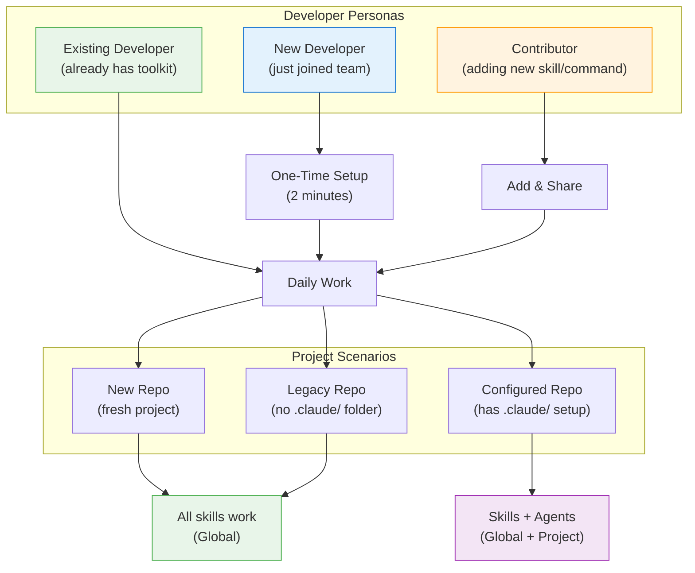
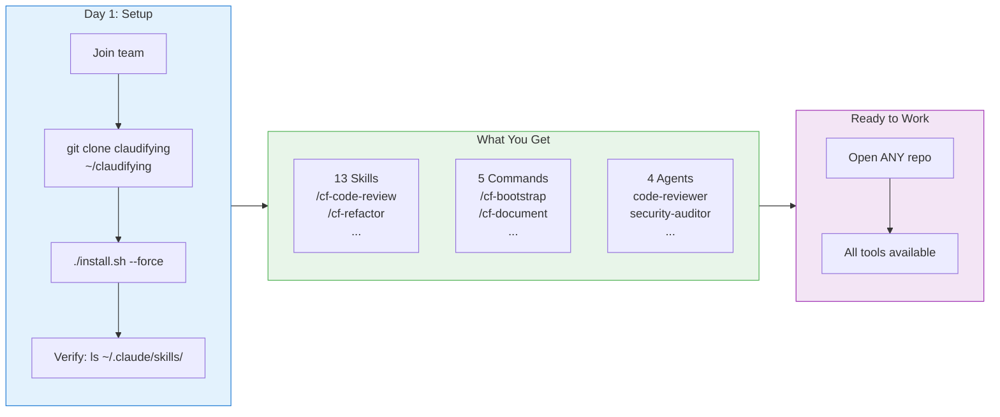
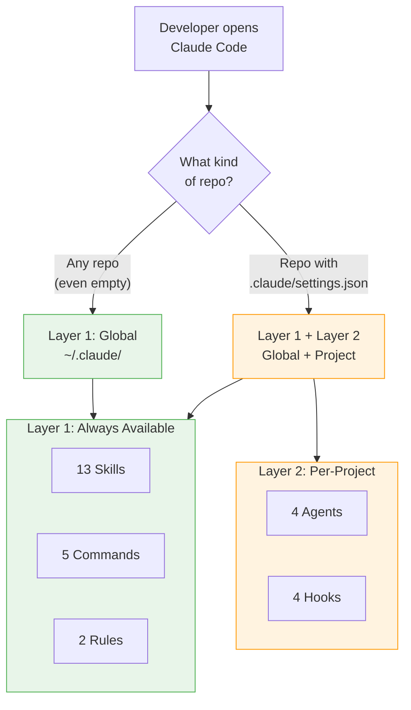
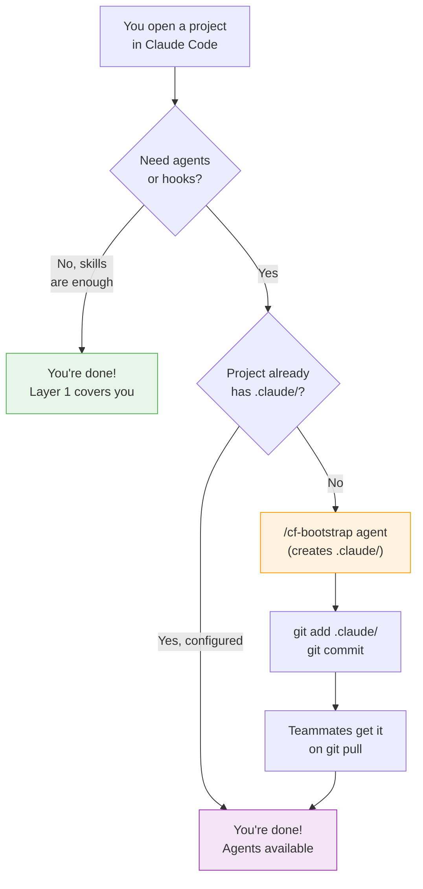
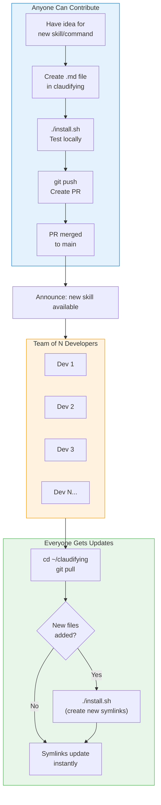
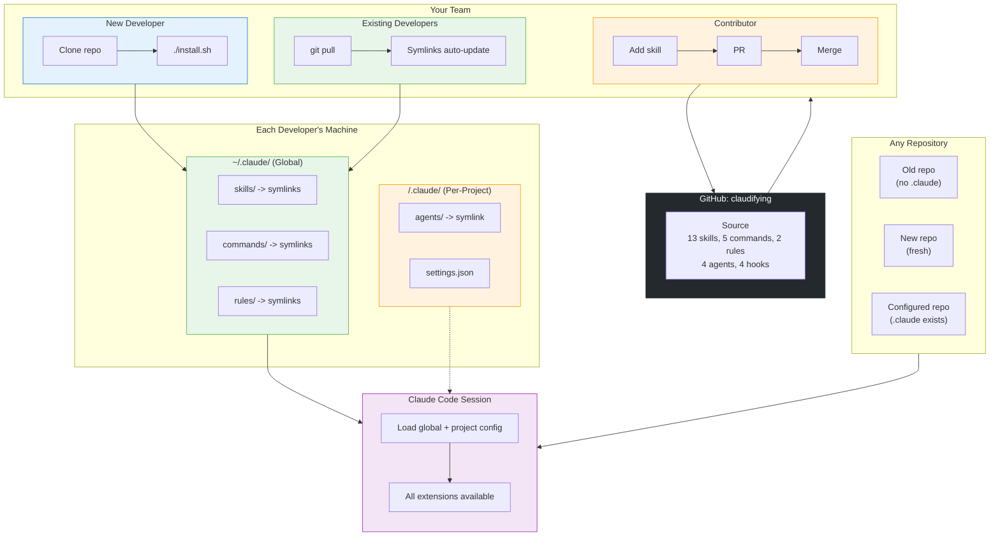
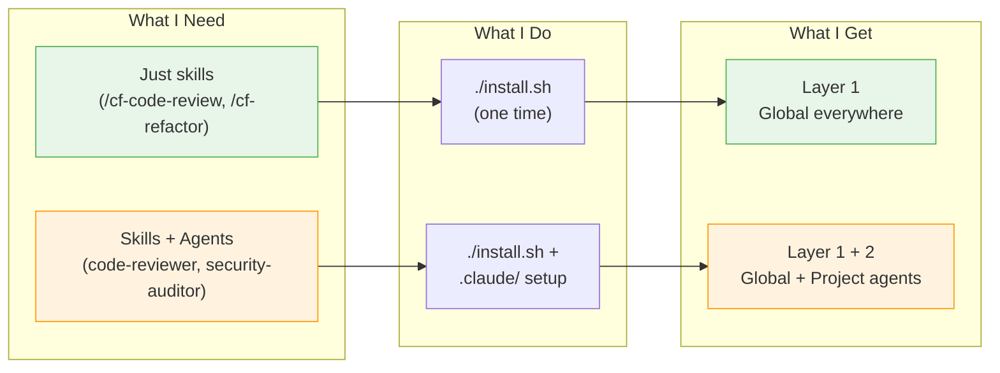

# Developer Journey with Claudifying

Visual guides for using Claudifying at different stages of your development workflow.

## 1. Developer Personas & Scenarios

## 2. New Developer Onboarding

## 3. Daily Workflow: Which Layer Applies?

## 4. Project Setup Decision Tree

## 5. Contribution & Update Cycle

## 6. Complete System Overview

## 7. What Do I Need? Decision Matrix

---

**Want to contribute?** See the decision tree above + [README.md](../README.md) for the contribution workflow.

**Questions?** Check [DAILY-PRACTICES.md](./DAILY-PRACTICES.md) for tips + tricks, or [AGENT-TEAMS.md](./AGENT-TEAMS.md) for parallel development patterns.
